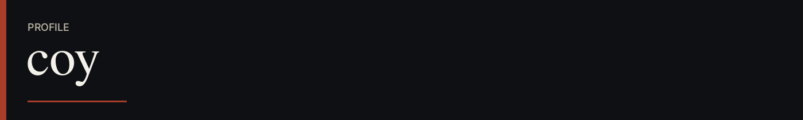
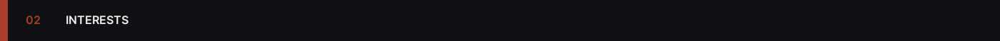
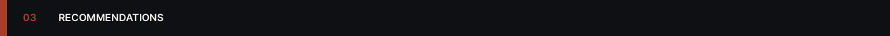

  

 

My name is Coy

I'm deeply into philosophy; I'm an optimistic nihilist & an antinatalist.  
Favorite philosophers: Nietzsche, Schopenhauer, Camus & Sartre. (In order)

I like feminine terms, but still call me a he.  
i.e "Ms/Queen/whateverthehell Coy wow, he's so pretty"  
but don't glaze me like that unjokingly, I think that's a little weird.

I'm fine with adults interacting with me if you aren't a creep.  
That's all I'll say due to limited space, just talk to me if you're interested.  
If normal, there's 0 biting.

 

 

Hobbies: Playing guitar, writing, photographing, illustrating & dissecting  
Genres: Philosophy, horror eroge, ero guro, body horror,  
&nbsp;&nbsp;&nbsp;&nbsp;&nbsp;&nbsp;&nbsp;&nbsp;&nbsp;&nbsp;&nbsp;&nbsp;&nbsp;&nbsp;psychological horror, speculative evolution,  
&nbsp;&nbsp;&nbsp;&nbsp;&nbsp;&nbsp;&nbsp;&nbsp;&nbsp;&nbsp;&nbsp;&nbsp;&nbsp;&nbsp;post-apocalyptic sci-fi

 

 

TV Shows: Mr. Robot & American Gods  
Visual Novels: Saya no Uta, Steins;Gate, Katawa Shoujo,  
&nbsp;&nbsp;&nbsp;&nbsp;&nbsp;&nbsp;&nbsp;&nbsp;&nbsp;&nbsp;&nbsp;&nbsp;&nbsp;&nbsp;&nbsp;&nbsp;&nbsp;&nbsp;&nbsp;&nbsp;&nbsp;&nbsp;&nbsp;&nbsp;&nbsp;&nbsp;Teaching Feeling, Higurashi & SubaHibi  
Mangas: Tokyo Akazukin, Null-Meta, Sayonara Zetsubou Sensei, Ashizuri Suizokukan,  
&nbsp;&nbsp;&nbsp;&nbsp;&nbsp;&nbsp;&nbsp;&nbsp;&nbsp;&nbsp;&nbsp;&nbsp;&nbsp;&nbsp;Shadow Star, Made in Abyss, Mai-chan's Daily Life & Shimeji Simulation  
Animes: A Silent Voice, Monster, Inuyashiki, Bungo Stray Dogs,  
&nbsp;&nbsp;&nbsp;&nbsp;&nbsp;&nbsp;&nbsp;&nbsp;&nbsp;&nbsp;&nbsp;&nbsp;&nbsp;&nbsp;Alien Nine, Evangelion, Parasyte, Nichijou,  
&nbsp;&nbsp;&nbsp;&nbsp;&nbsp;&nbsp;&nbsp;&nbsp;&nbsp;&nbsp;&nbsp;&nbsp;&nbsp;&nbsp;Girls Last Tour, Haibane Renmei & Serial Experiments Lain
